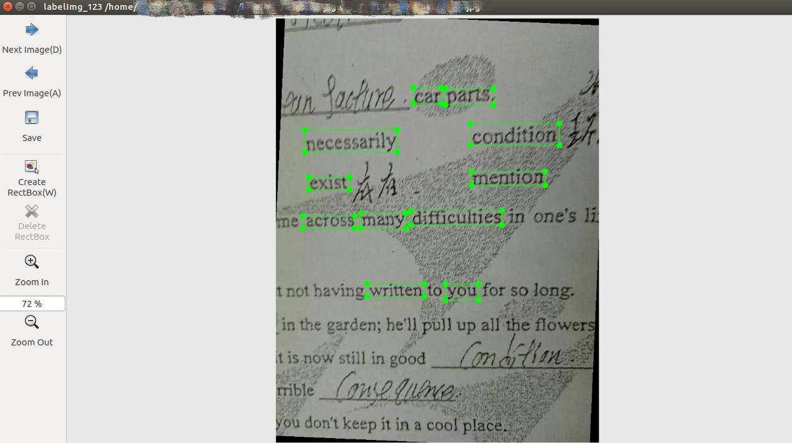

# LabelImg_ZYP

LabelImg_ZYP is a express edition of LabelImg which is a powerful graphical image annotation tool.

It is written in Python and uses Qt for its graphical interface.

Annotations are saved as XML files in PASCAL VOC format, the format used by [ImageNet](http://www.image-net.org/).

### Demo
#### LabelImg_ZYP

#### LabelImg 

### Build from source

Linux/Ubuntu/Mac requires at least [Python 2.6](http://www.python.org/getit/) and has been tested with [PyQt
4.8](http://www.riverbankcomputing.co.uk/software/pyqt/intro).

#### Ubuntu Linux

    sudo apt-get install pyqt4-dev-tools
    sudo pip install lxml
    make all
    ./labelImg.py

#### OS X

    brew install qt qt4
    brew install libxml2
    make all
    ./labelImg.py

#### Windows

Download and setup [Python 2.6 or later](https://www.python.org/downloads/windows/), [PyQt4](https://www.riverbankcomputing.com/software/pyqt/download) and [install lxml](http://lxml.de/installation.html).

Open cmd and go to [labelImg]

    pyrcc4 -o resources.py resources.qrc
    python labelImg.py

## Usage

### Steps

1. Build using the instructions above. 
2. Put images to the folder named 'Imgs'.
3. Launch labelImg.py
4. Click 'Create RectBox'
3. Click and release left mouse to select a region to annotate the rect box

The annotation will be saved to the folder 'Imgs'.

You can refer to the below hotkeys to speed up your workflow.

### Hotkeys

|          |                                          |
|----------|------------------------------------------|
| Ctrl + s | Save                                     |
| w        | Create a rect box                        |
| d        | Next image                               |
| a        | Previous image                           |
| del      | Delete the selected rect box             |
| Ctrl++   | Zoom in                                  |
| Ctrl--   | Zoom out                                 |

